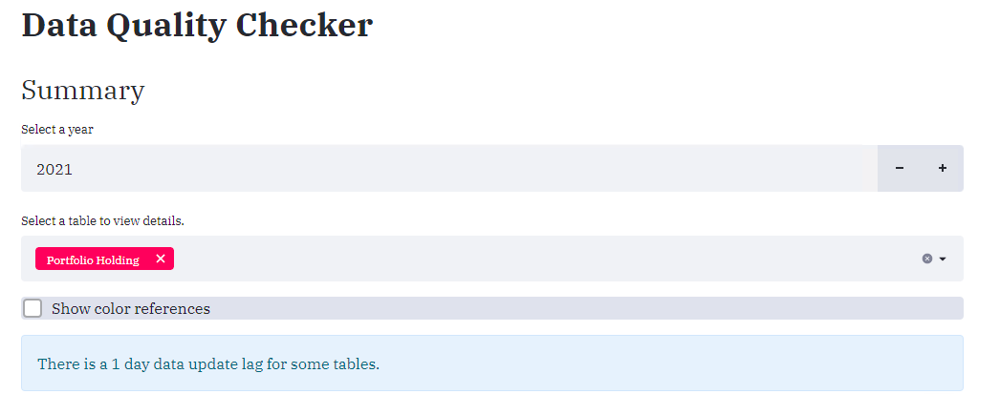

# Data Quality Checker
Verifies data quality for the 6 main data tables.

## Yearly Calendar View
  
  
  Tables we can select to view.  
  
  
  
The calendars with problematic entries highlighted. Each type of error from each table is highlighted with a different color.  

  
  
  Reference table for the color we can choose.  
  
  
  Examples of tables with many errors.  
    

# Daily view
We can choose whether to use US or CAD holidays or both.

